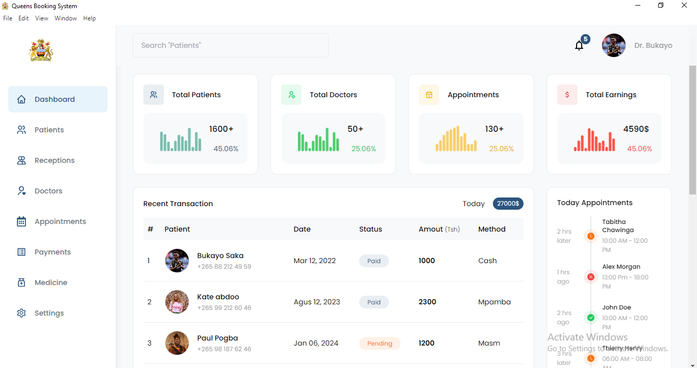

<<<<<<< HEAD

# Queen Elizabeth Booking System - Queens


## Project Overview

The Queen Elizabeth Booking System (Queens) is a desktop-based hospital booking application, built using Electron for cross-platform desktop support and React for an intuitive and dynamic frontend interface. The system will provide clinic management and patient scheduling for Queen Elizabeth Central Hospital, with a focus on improving operational efficiency.

## Features

- Desktop-based application 
- Dynamic user Interface
- Offline support with SQLite 
- Modular architecture for easy scalability
- Automatic Reminders to patients [In the future]. 

## Screenshot

Here is a preview of the system's current interface:



## Instructions

To set up the project locally, follow these steps:

1. **Clone the repository:**
```bash
git clone https://github.com/Drizo7/queens-booking.git
```

2. **Navigate to the root folder:**
```bash
cd queens-booking
```

3. **Install root project dependencies:**
```bash
npm install
```

4. **Install frontend dependencies:**
```bash
cd frontend && npm install
```

## Usage

To run the application in development mode:

1. In the root directory, start the development server:
```bash
npm start
```

2. Wait for the Electron application to open automatically.

3. Alternatively, you can manually open the application by visiting the React app at http://localhost:3000 in your browser.

## Technologies Used

- Electron
- React
- Tailwind Css
- Node.Js
- Sqlite

## Contributing

Feel free to contribute to the Queen Elizabeth Booking System! Here are some ways you can get started:

Reporting a bug
Discussing the current state of the code
Submitting a fix
Proposing new features
Providinf additional documentation
Becoming a maintainer

## License

By contributing, you agree that your contributions will be licensed under MIT License.
=======
# queens-booking
Queen Elizabeth Central Hospital Booking System
>>>>>>> 2ac2dbb55293aa9d2105bc63890c134f525e94fe
